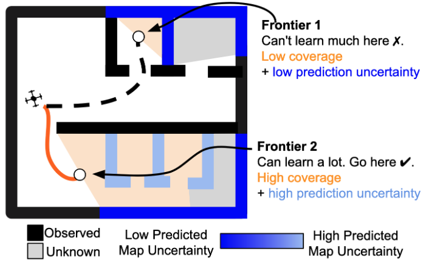

Hi, I’m Cherie! I’m a PhD Student in the [Robotics Institute](https://www.ri.cmu.edu/) at Carnegie Mellon University advised by [Sebastian Scherer](https://www.ri.cmu.edu/ri-faculty/sebastian-scherer/). I am part of the [Air Lab](http://theairlab.org/) and the [Field Robotics Center](https://frc.ri.cmu.edu/). 

    

My research interest is in the intersection of **field robotics, computer vision and machine learning** to develop **robots that can continuously learn** in new scenarios by reasoning about **uncertainties and consequences**. Developing such robots can break the need of immense human engineering when encountering new situations and environments and pave the way for robots capable of operating effectively and at scale in diverse scenarios. 
<!-- Towards this, I develop **generalizable**, **adaptive** and **uncertainty-aware** robot algorithms to enable reliable autonomy in dynamic real-world applications, such as [motion capture in forests](https://youtu.be/jxt91vx0cns), [high-speed offroad driving](https://theairlab.org/offroad/), and now autonomous wheelchairs. For more information, please see my [research background & vision](research). -->

    <b>I am on the academic job market (tenure-track faculty / postdoc) this year!</b> 
    Please <a href="mailto:cherieh@andrew.cmu.edu">reach out &#9993;</a> if you think our <a href="research">research interests</a>
     align! 
      
     I am interested in developing <b>generalizable</b>, <b>adaptive</b> and <b>uncertainty-aware</b> robot algorithms for dynamic real-world applications. I have worked on applications such as <a href="https://youtu.be/jxt91vx0cns">motion capture in forests</a>, <a href="https://theairlab.org/offroad/">high-speed offroad driving</a>, and now autonomous wheelchairs. See my full list of publications <a href="publications">here</a>.

  <a href="media/cherieho_cv_2024_09.pdf">CV</a> /
  <a href="https://scholar.google.com/citations?user=j8lsq7sAAAAJ&hl=en">Google Scholar</a> / 
  <a href="https://x.com/hocherie1">Twitter</a> / 
  <a href="https://www.linkedin.com/in/cherieho/">LinkedIn</a> 

<!-- [CV](cherieho_cv_2020_06.pdf) / [Google Scholar](https://scholar.google.com/citations?user=j8lsq7sAAAAJ&hl=en) -->

During my PhD, I interned with [Ashish Kapoor](https://www.microsoft.com/en-us/research/people/akapoor/) and [Shuang Ma](https://www.shuangma.me/) at Microsoft. I did my undergrad at Harvey Mudd College, where I worked with [Chris Clark](https://www.lair.hmc.edu/chris-clark) on [shark-tracking underwater robots](sharktracking). Between Harvey Mudd and CMU, I cofounded Zenith Robotics with Chris Clark and Vai Viswanathan.

### Recent News 
* **Sep 2024** Paper on [*empowering map prediction with large-scale public data*](https://mapitanywhere.github.io/) accepted to NeurIPS 2024! Looking forward to Vancouver! 
* **Jul 2024** Paper on [*online learning for offroad driving*](https://arxiv.org/abs/2306.15226) accepted to IROS 2024! See you in Abu Dhabi!
* **Mar 2024** Our workshop on autonomous offroad driving is accepted to ICRA 2024!
<!-- * **May-Aug 2021** Spending this summer at Microsoft working on "Pretraining for Safety" with [Ashish Kapoor](https://www.microsoft.com/en-us/research/people/akapoor/) and [Shuang Ma](https://www.shuangma.me/)! -->
<!-- * **Jul 2021** [Paper](https://arxiv.org/abs/2108.03936) on multi-drone human reconstruction accepted at IROS 2021! -->
<!-- * **April 2021** Excited to give invited talks at Apple and Lehigh University. Watch the Lehigh talk [here](https://youtu.be/R1a-31YH3H8). -->
<!-- * **Aug 2020** Excited to give an invited talk at UIUC's [ACRL Lab](http://naira.mechse.illinois.edu/). -->
<!-- * **Jul 2020** [Mohammadreza](https://www.cs.cmu.edu/~mmousaei/) and I gave a tutorial session on "Guaranteeing Safety in the Real World". Watch our talk [here](https://youtu.be/vmRl8swiEyc)! Play with control barrier functions [here](https://github.com/hocherie/cbf_quadrotor)! -->
<!-- * **May 2019** I was awarded the [Croucher Foundation Scholarship](https://croucher.org.hk/funding/study_awards/scholarships) for the next two years!  -->
<!-- * [2019/03] Invited to present research at the Amazon Graduate Student Symposium, Seattle. -->

 
### Selected Publications
See the full list of my publication [here](publications).

    
2024

    

        

            
        

        

            <a href="https://mapitanywhere.github.io/"><b>Map It Anywhere: Empowering BEV Map Prediction using Large-scale Public Datasets</b></a> 
            <b>Cherie Ho*</b>, Jiaye Zou*, Omar Alama*, Sai Mitheran Jagadesh Kumar, Benjamin Chiang, Taneesh Gupta,
            Chen Wang, Nikhil Keetha, Katia Sycara, Sebastian Scherer 
             
             
            <i>Neural Information Processing Systems (NeurIPS) Datasets and Benchmarks Track</i>, 2024
             
            <a href="https://mapitanywhere.github.io/">[Website]</a> <a href="https://arxiv.org/abs/2407.08726">[PDF]</a> <a href="https://github.com/MapItAnywhere/MapItAnywhere"
            >[Code]</a> 
        

    

    

        

            
        

        

            <a href="https://arxiv.org/abs/2306.15226"><b>Learning-on-the-Drive: Self-supervised Adaptation of Visual Offroad Traversability Models</b></a> 
            <b>Cherie Ho*</b>, Eric Chen*, Mukhtar Maulimov, Chen Wang, Sebastian Scherer
             
             
            <i>International Conference on Intelligent Robots and Systems (IROS)</i>, 2024   
            <a href="https://arxiv.org/abs/2306.15226">[PDF]</a>
        

    

    

        

            
        

        

            <a href="https://arxiv.org/abs/2409.15590"><b>MapEx: Indoor Structure Exploration with Probabilistic Information Gain from Global Map Predictions</b></a> 
            <b>Cherie Ho*</b>, Seungchan Kim*, Brady Moon, Aditya Parandekar, Narek Harutyunyan, Chen Wang, Katia Sycara, Graeme Best, Sebastian Scherer
             
             
            <i>In Submission</i>, 2024
              <a href="https://arxiv.org/abs/2409.15590">[PDF]</a>
        

    

    

        

            
        

        

            <a href="https://theairlab.org/SALON/"><b>SALON: Self-supervised Adaptive Learning for Off-road Navigation</b></a> 
            Matthew Sivaprakasam, Samuel Triest, <b>Cherie Ho</b>, Shubhra Aich, Jeric Lew, Isaiah Adu, Wenshan Wang, Sebastian Scherer
             
            <i>In Submission</i>, 2024   
            <a href="https://theairlab.org/SALON">[Website]</a>
            <a href="https://theairlab.org/SALON/assets/Adaptive_Costmaps_ICRA_2025__arxiv_.pdf">[PDF]</a>
            <a href="https://github.com/castacks/salon_ws">[Code]</a>
        

    

    
2021

    

        

            
        

        

            <a href="https://arxiv.org/abs/2108.03936"><b>3D Human Reconstruction in the Wild with Collaborative Aerial Cameras</b></a> 
            <b>Cherie Ho</b>, Andrew Jong, Harry Freeman, Rohan Rao, Rogerio Bonatti, Sebastian Scherer
             
             
            <i>International Conference on Intelligent Robots and Systems (IROS)</i>, 2021   
            <a href="https://arxiv.org/abs/2108.03936">[PDF]</a> <a href="https://youtu.be/jxt91vx0cns">[Video]</a>
        

    

### Honors & Awards
* **2019-2021** Croucher Scholarship for Doctoral Study (Full Scholarship)
* **2019** Best Paper Finalist, IROS Vision-based Drones Workshop
* **2018** HMC INQ Inaugural Class (Harvey Mudd Startup Incubator)
* **2017** Harvey Mudd College Johnson Excellence in Engineering Award
* **2017** Harvey Mudd College Engineering Departmental Honors
* **2016** University of Southern California Wrigley Institute Graduate Summer Fellowship (as an undergraduate)
* **2014 - 2017** Jude and Eileen Laspa Fellowship in Autonomous Systems
* **2015** First Place, MuddHacks (Gesture-controlled helicopter)
