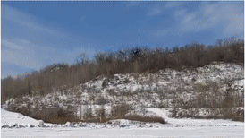
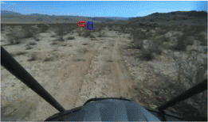
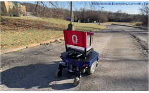
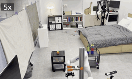
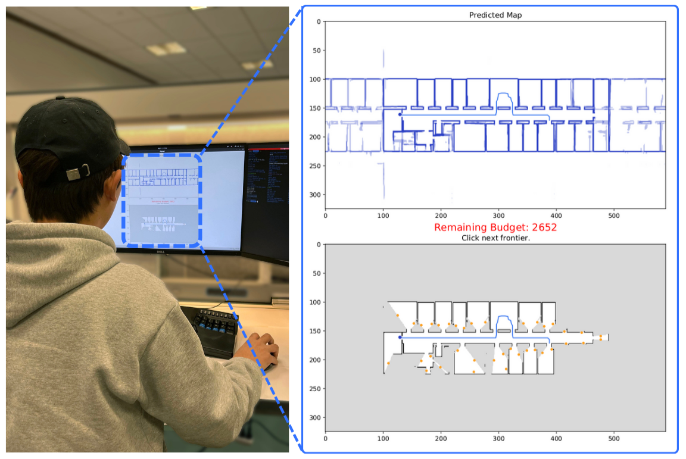
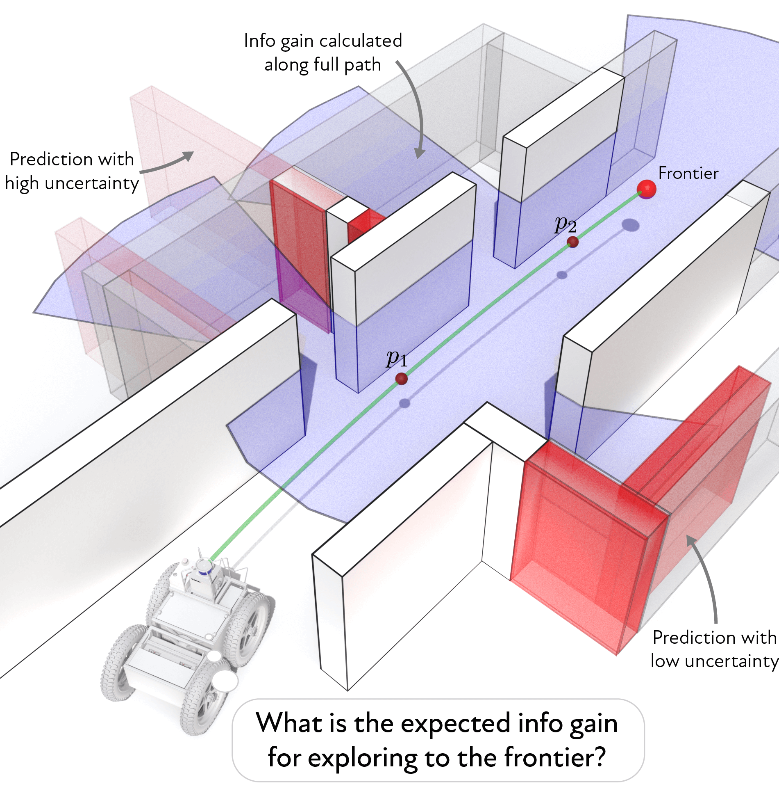
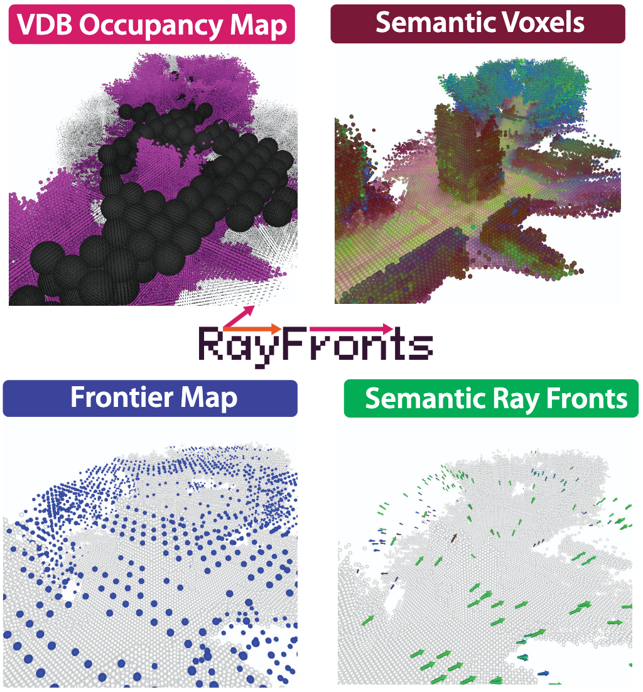
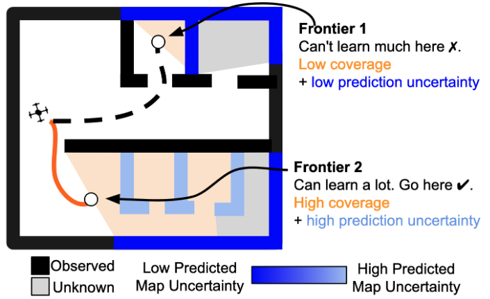
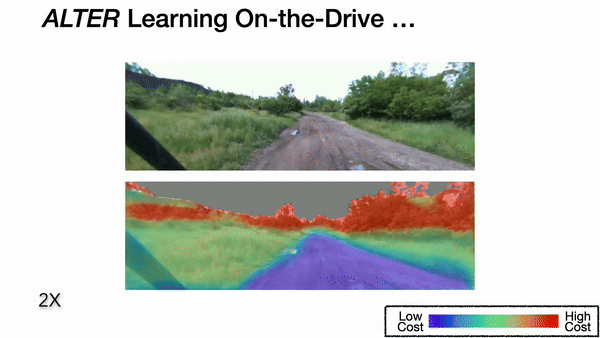
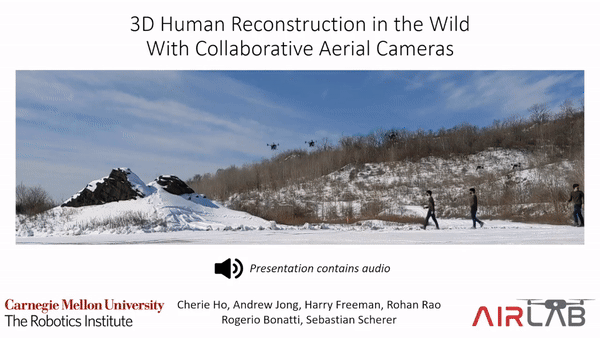

Hi, I’m Cherie! I am a postdoc at Stanford University working with [Prof. Jeannette Bohg](https://web.stanford.edu/~bohg/). I am grateful to be supported by the [Croucher Fellowship for Postdoctoral Research](https://croucher.org.hk/en/fellows-and-scholars/cherie-ho). I completed my PhD in the [Robotics Institute](https://www.ri.cmu.edu/) at Carnegie Mellon University, where I was advised by [Prof. Sebastian Scherer](https://www.ri.cmu.edu/ri-faculty/sebastian-scherer/). 

  

    
    
Multi-Drone Motion Capture

  

  

    
    
Offroad Driving

  

  

    
    
Urban Wheelchair

  

  

    
    
Mobile Manipulation

  

My research goal is to build **flexible and self-improving robots** that operate reliably in **messy, real-world environments**. I focus on how robots can build memory that is flexible for long-horizon tasks, steered by different types of goals, reason about uncertainty and consequences, and continually adapt through their own experience. I have had the joy of working across diverse robotic platforms, including multi-drone systems, high-speed offroad driving, urban wheelchairs, and now mobile manipulators in messy settings.

Email: cherieho at stanford dot edu

  <a href="media/Ho_Cherie_CV_Dec2024.pdf">CV</a> /
  <a href="https://scholar.google.com/citations?user=j8lsq7sAAAAJ&hl=en">Google Scholar</a> / 
  <a href="https://x.com/hocherie1">Twitter</a> / 
  <a href="https://www.linkedin.com/in/cherieho/">LinkedIn</a> 

<!-- [CV](cherieho_cv_2020_06.pdf) / [Google Scholar](https://scholar.google.com/citations?user=j8lsq7sAAAAJ&hl=en) -->

<!-- During my PhD, I interned with [Ashish Kapoor](https://www.microsoft.com/en-us/research/people/akapoor/) and [Shuang Ma](https://www.shuangma.me/) at Microsoft. I did my undergrad at Harvey Mudd College, where I worked with [Chris Clark](https://www.lair.hmc.edu/chris-clark) on [shark-tracking underwater robots](sharktracking). Between Harvey Mudd and CMU, I cofounded Zenith Robotics with Chris Clark and Vai Viswanathan. -->

### Recent News 
* **07/25** Started my postdoc at Stanford with [Prof. Jeannette Bohg](https://web.stanford.edu/~bohg/) working on mobile manipulators!
* **07/25** Gratefully awarded the [Croucher Fellowship](https://croucher.org.hk/en/fellows-and-scholars/cherie-ho) for two years of postdoc funding to work on "Flexible and Self-Improving Robots"!
* **04/25** Honored to be one of the 33 [RSS Pioneers](https://roboticsconference.org/program/pioneers/).
* **01/25** 2 papers accepted to ICRA 2025! One on [predicting world models for exploration](https://mapex-explorer.github.io/), another on [autonomous exploration and adaptation for offroad driving](https://theairlab.org/SALON/).
* **10/24** Thrilled to be at [OECD](https://www.oecd.org/) in Paris for the [AI and the Future of Skills](https://www.oecd.org/en/about/projects/artificial-intelligence-and-future-of-skills.html) AI expert meeting. Excited to capture thoughts on measuring robotics capability in the "Robotic intelligence scale" chapter of the OECD's [AI Capability Indicators whitepaper](https://www.oecd.org/content/dam/oecd/en/publications/reports/2025/06/introducing-the-oecd-ai-capability-indicators_7c0731f0/be745f04-en.pdf)!
<!-- * **09/24** Paper on [*empowering map prediction with large-scale public data*](https://mapitanywhere.github.io/) accepted to NeurIPS 2024! Looking forward to Vancouver! -->
<!-- * **07/24** Paper on [*online learning for offroad driving*](https://arxiv.org/abs/2306.15226) accepted to IROS 2024! See you in Abu Dhabi! -->
<!-- * **03/24** Our workshop on autonomous offroad driving is accepted to ICRA 2024! -->
<!-- * **May-Aug 2021** Spending this summer at Microsoft working on "Pretraining for Safety" with [Ashish Kapoor](https://www.microsoft.com/en-us/research/people/akapoor/) and [Shuang Ma](https://www.shuangma.me/)! -->
<!-- * **Jul 2021** [Paper](https://arxiv.org/abs/2108.03936) on multi-drone human reconstruction accepted at IROS 2021! -->
<!-- * **April 2021** Excited to give invited talks at Apple and Lehigh University. Watch the Lehigh talk [here](https://youtu.be/R1a-31YH3H8). -->
<!-- * **Aug 2020** Excited to give an invited talk at UIUC's [ACRL Lab](http://naira.mechse.illinois.edu/). -->
<!-- * **Jul 2020** [Mohammadreza](https://www.cs.cmu.edu/~mmousaei/) and I gave a tutorial session on "Guaranteeing Safety in the Real World". Watch our talk [here](https://youtu.be/vmRl8swiEyc)! Play with control barrier functions [here](https://github.com/hocherie/cbf_quadrotor)! -->
<!-- * **May 2019** I was awarded the [Croucher Foundation Scholarship](https://croucher.org.hk/funding/study_awards/scholarships) for the next two years!  -->
<!-- * [2019/03] Invited to present research at the Amazon Graduate Student Symposium, Seattle. -->

 
### Selected Publications
See the full list of my publication [here](publications).

    
2026

    

        

            
        

        

            <b>MessyMem: Learning-from-Doing Memory for Mobile Manipulation</b> 
            Anuva Banwasi, William Muckelroy III, Priya Sundaresan, Linfeng Zhao, Jeannette Bohg, <b>Cherie Ho</b>
        

    

    

        

            
        

        

            <b>MessyNav: Zero-Shot Navigation via Manipulation in Messy Environments</b> 
            Kenneth Llontop, <b>Cherie Ho</b>, Dylan Zhou, Anuva Banwasi, Carlota Pares-Morlans, Priya Sundaresan, Jeannette Bohg
        

    

    

        

            
        

        

            <a href="https://scanford-robot.github.io/"><b>Robot-Powered Data Flywheels: Deploying Robots in the Wild for Continual Data Collection and Foundation Model Adaptation</b></a> 
            Jennifer Grannen, Michelle Pan, Kenneth Llontop, <b>Cherie Ho</b>, Mark Zolotas, Jeannette Bohg, Dorsa Sadigh
             
             
            <i>arXiv preprint</i>, 2026
             
            <a href="https://scanford-robot.github.io/">[Website]</a> <a href="https://arxiv.org/abs/2511.19647">[PDF]</a>
        

    

    
2025

    

        

            
        

        

            <a href="https://arxiv.org/abs/2503.01548"><b>MapExRL: Human-Inspired Indoor Exploration with Predicted Environment Context and Reinforcement Learning</b></a> 
            Narek Harutyunyan, Brady Moon, Seungchan Kim, <b>Cherie Ho</b>, Adam Hung, Sebastian Scherer
             
             
            <i>IEEE International Conference on Advanced Robotics (ICAR)</i>, 2025
             
            <a href="https://mapexrl.github.io">[Website]</a> <a href="https://arxiv.org/abs/2503.01548">[PDF]</a>
        

    

    

        

            
        

        

            <a href="https://arxiv.org/abs/2503.07504"><b>PIPE Planner: Pathwise Information Gain with Map Predictions for Indoor Robot Exploration</b></a> 
            Seungjae Baek, Brady Moon, Seungchan Kim, Muqing Cao, <b>Cherie Ho</b>, Sebastian Scherer, Jeong hwan Jeon
             
             
            <i>IEEE/RSJ International Conference on Intelligent Robots and Systems (IROS)</i>, 2025
             
            <a href="https://pipe-planner.github.io/">[Website]</a> <a href="https://arxiv.org/abs/2503.07504">[PDF]</a> <a href="https://github.com/castacks/pipe-planner">[Code]</a>
        

    

    

        

            
        

        

            <a href="https://rayfronts.github.io/"><b>RayFronts: Open-Set Semantic Ray Frontiers for Online Scene Understanding and Exploration</b></a> 
            Omar Alama, Avigyan Bhattacharya, Haoyang He, Seungchan Kim, Yuheng Qiu, Wenshan Wang, <b>Cherie Ho</b>, Nikhil Keetha, Sebastian Scherer
             
             
            <i>IEEE/RSJ International Conference on Intelligent Robots and Systems (IROS)</i>, 2025
             
            <a href="https://rayfronts.github.io/">[Website]</a> <a href="https://arxiv.org/abs/2504.06994">[PDF]</a> <a href="https://github.com/RayFronts/RayFronts">[Code]</a>
        

    

    

        

            
        

        

            <a href="https://mapex-explorer.github.io/"><b>MapEx: Indoor Structure Exploration with Probabilistic Information Gain from Global Map Predictions</b></a> 
            <b>Cherie Ho*</b>, Seungchan Kim*, Brady Moon, Aditya Parandekar, Narek Harutyunyan, Chen Wang, Katia Sycara, Graeme Best, Sebastian Scherer
             
             
            <i>IEEE International Conference on Robotics and Automation (ICRA)</i>, 2025
             
            <a href="https://mapex-explorer.github.io/">[Website]</a> <a href="https://arxiv.org/abs/2409.15590">[PDF]</a> <a href="https://github.com/castacks/MapEx">[Code]</a>
        

    

    

        

            
        

        

            <a href="https://theairlab.org/SALON/"><b>SALON: Self-supervised Adaptive Learning for Off-road Navigation</b></a> 
            Matthew Sivaprakasam, Samuel Triest, <b>Cherie Ho</b>, Shubhra Aich, Jeric Lew, Isaiah Adu, Wenshan Wang, Sebastian Scherer
             
            <i>IEEE International Conference on Robotics and Automation (ICRA)</i>, 2025   
            <a href="https://theairlab.org/SALON">[Website]</a>
            <a href="https://theairlab.org/SALON/assets/Adaptive_Costmaps_ICRA_2025__arxiv_.pdf">[PDF]</a>
            <a href="https://github.com/castacks/salon_ws">[Code]</a>
        

    

    
2024

    

        

            
        

        

            <a href="https://mapitanywhere.github.io/"><b>Map It Anywhere: Empowering BEV Map Prediction using Large-scale Public Datasets</b></a> 
            <b>Cherie Ho*</b>, Jiaye Zou*, Omar Alama*, Sai Mitheran Jagadesh Kumar, Benjamin Chiang, Taneesh Gupta,
            Chen Wang, Nikhil Keetha, Katia Sycara, Sebastian Scherer 
             
             
            <i>Neural Information Processing Systems (NeurIPS) Datasets and Benchmarks Track</i>, 2024
             
            <a href="https://mapitanywhere.github.io/">[Website]</a> <a href="https://arxiv.org/abs/2407.08726">[PDF]</a> <a href="https://github.com/MapItAnywhere/MapItAnywhere"
            >[Code]</a> 
        

    

    

        

            
        

        

            <a href="https://arxiv.org/abs/2306.15226"><b>Learning-on-the-Drive: Self-supervised Adaptation of Visual Offroad Traversability Models</b></a> 
            <b>Cherie Ho*</b>, Eric Chen*, Mukhtar Maulimov, Chen Wang, Sebastian Scherer
             
             
            <i>International Conference on Intelligent Robots and Systems (IROS)</i>, 2024   
            <a href="https://arxiv.org/abs/2306.15226">[PDF]</a>
        

    

    
2021

    

        

            
        

        

            <a href="https://arxiv.org/abs/2108.03936"><b>3D Human Reconstruction in the Wild with Collaborative Aerial Cameras</b></a> 
            <b>Cherie Ho</b>, Andrew Jong, Harry Freeman, Rohan Rao, Rogerio Bonatti, Sebastian Scherer
             
             
            <i>International Conference on Intelligent Robots and Systems (IROS)</i>, 2021   
            <a href="https://arxiv.org/abs/2108.03936">[PDF]</a> <a href="https://youtu.be/jxt91vx0cns">[Video]</a>
        

    

### Honors & Awards
* **2025** Croucher Fellowship for Postdoctoral Research
* **2025** Robotics: Science and Systems (RSS) Pioneer
* **2019-2021** Croucher Scholarship for Doctoral Study (Full Scholarship)
* **2019** Best Paper Finalist, IROS Vision-based Drones Workshop
* **2018** HMC INQ Inaugural Class (Harvey Mudd Startup Incubator)
* **2017** Harvey Mudd College Johnson Excellence in Engineering Award
* **2017** Harvey Mudd College Engineering Departmental Honors
* **2016** University of Southern California Wrigley Institute Graduate Summer Fellowship (as an undergraduate)
* **2014 - 2017** Jude and Eileen Laspa Fellowship in Autonomous Systems
* **2015** First Place, MuddHacks (Gesture-controlled helicopter)
