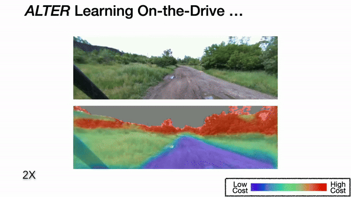

Hi, I’m Cherie! I’m a PhD Student in the [Robotics Institute](https://www.ri.cmu.edu/) at Carnegie Mellon University advised by [Sebastian Scherer](https://www.ri.cmu.edu/ri-faculty/sebastian-scherer/). I am part of the [Air Lab](http://theairlab.org/) and the [Field Robotics Center](https://frc.ri.cmu.edu/). 
I did my undergrad at Harvey Mudd College, where I worked with [Chris Clark](https://www.lair.hmc.edu/chris-clark) on shark-tracking underwater robots. Between Harvey Mudd and CMU, I cofounded Zenith Robotics with Chris Clark and Vai Viswanathan.

My research interest is in the intersection of **field robotics, computer vision and machine learning** towards the goal of bringing robots to uncertain safety-critical environments. Specifically, I develop robot learning algorithms to enable reliable autonomy in dynamic real-world applications, such as motion capture in [forests](https://youtu.be/jxt91vx0cns), search and rescue in [underground mines](https://drive.google.com/file/d/15Q55RPX8ZWd-83oKYTa3aY4wm2O6isiH/view), and now [offroad driving](https://www.cmu.edu/news/stories/archives/2022/september/off-road-autonomy.html). 

  <a href="media/cherieho_cv_2020_10.pdf">CV</a> /
  <a href="https://scholar.google.com/citations?user=j8lsq7sAAAAJ&hl=en">Google Scholar</a>

<!-- [CV](cherieho_cv_2020_06.pdf) / [Google Scholar](https://scholar.google.com/citations?user=j8lsq7sAAAAJ&hl=en) -->

    

### Selected News 
* **Jul 2024** Paper on online learning for offroad driving accepted to IROS 2024!
* **Mar 2024** Our workshop on autonomous off-road driving is accepted to ICRA 2024!
<!-- * **May-Aug 2021** Spending this summer at Microsoft working on "Pretraining for Safety" with [Ashish Kapoor](https://www.microsoft.com/en-us/research/people/akapoor/) and [Shuang Ma](https://www.shuangma.me/)! -->
* **Jul 2021** [Paper](https://arxiv.org/abs/2108.03936) on multi-drone human reconstruction accepted at IROS 2021!
<!-- * **April 2021** Excited to give invited talks at Apple and Lehigh University. Watch the Lehigh talk [here](https://youtu.be/R1a-31YH3H8). -->
<!-- * **Aug 2020** Excited to give an invited talk at UIUC's [ACRL Lab](http://naira.mechse.illinois.edu/). -->
<!-- * **Jul 2020** [Mohammadreza](https://www.cs.cmu.edu/~mmousaei/) and I gave a tutorial session on "Guaranteeing Safety in the Real World". Watch our talk [here](https://youtu.be/vmRl8swiEyc)! Play with control barrier functions [here](https://github.com/hocherie/cbf_quadrotor)! -->
* **May 2019** I was awarded the [Croucher Foundation Scholarship](https://croucher.org.hk/funding/study_awards/scholarships) for the next two years! 
<!-- * [2019/03] Invited to present research at the Amazon Graduate Student Symposium, Seattle. -->

### Publications
##### Preprints

    

        
    

    

        <a href="https://arxiv.org/abs/2306.15226"><b>Map It Anywhere: Empowering BEV Map Prediction using Large-scale Public Datasets</b></a> 
         <b>Cherie Ho*</b>, Jiaye Zou*, Omar Alama*, Sai Mitheran Jagadesh Kumar, Benjamin Chiang, Taneesh Gupta,
Chen Wang, Nikhil Keetha, Katia Sycara, Sebastian Scherer 
         
        <a href="https://arxiv.org/abs/2407.08726">[PDF]</a>
    

##### Peer-reviewed Conferences and Journals

    

        
    

    

        <a href="https://arxiv.org/abs/2306.15226"><b>Learning-on-the-Drive: Self-supervised Adaptation of Visual Offroad Traversability Models</b></a> 
        <b>Cherie Ho*</b>, Eric Chen*, Mukhtar Maulimov, Chen Wang, Sebastian Scherer
         
        International Conference on Intelligent Robots and Systems (IROS), 2024   
        <a href="https://arxiv.org/abs/2306.15226">[PDF, updated version coming soon]</a>
    

    

        
    

    

        <a href="https://arxiv.org/abs/2108.03936"><b>3D Human Reconstruction in the Wild with Collaborative Aerial Cameras</b></a> 
        <b>Cherie Ho</b>, Andrew Jong, Harry Freeman, Rohan Rao, Rogerio Bonatti, Sebastian Scherer
         
        International Conference on Intelligent Robots and Systems (IROS), 2021   
        <a href="https://arxiv.org/abs/2108.03936">[PDF]</a> <a href="https://youtu.be/jxt91vx0cns">[Video]</a>
    

    

        
    

    

        <a href="https://www.ri.cmu.edu/wp-content/uploads/2020/03/rob.21931.pdf"><b>Autonomous Aerial Cinematography Among Unstructured Environments With Online Artistic Decision-Making</b></a> 
        Rogerio Bonatti, Wenshan Wang, <b>Cherie Ho</b>, Aayush Ahuja, Mirko Gschwindt, Efe Camci, Erdal Kayacan, Sanjiban Choudhury, Sebastian Scherer   
        Journal of Field Robotics, 2019 
        <a href="https://www.ri.cmu.edu/wp-content/uploads/2020/03/rob.21931.pdf">[PDF]</a> <a href="https://youtu.be/ookhHnqmlaU">[Video]</a>
    

    

        
    

    

        <a href="https://arxiv.org/abs/1904.02319"><b>Towards a Robust Aerial Cinematography Platform: Localizing and Tracking Moving Targets in Unstructured Environments</b></a> 
        Rogerio Bonatti, <b>Cherie Ho</b>, Wenshan Wang, Sanjiban Choudhury, Sebastian Scherer 
        International Conference on Intelligent Robots and Systems (IROS), 2019   
        <a href="https://arxiv.org/abs/1904.02319">[PDF]</a> <a href="https://youtu.be/ZE9MnCVmumc">[Video]</a>
    

    

        
    

    

        <a href="http://www.hmc.edu/lair/publications/2017/ho_SAC_2017.pdf"><b>Predicting coordinated group movements of sharks with limited observations using AUVs</b></a> 
        <b>Cherie Ho</b>, Kimberly Joly, Andrew P Nosal, Christopher G Lowe, Christopher M Clark 
        ACM Symposium on Applied Computing (SAC), 2017   
        <a href="http://www.hmc.edu/lair/publications/2017/ho_SAC_2017.pdf">[PDF]</a>
    

##### Workshops

    

        
    

    

        <a href="https://openreview.net/pdf?id=IIZGiKa8IK">
        <b>Adaptive Safety Margin Estimation for Safe Real-Time Replanning under Time-Varying Disturbance </b> 
        </a>
        <b>Cherie Ho</b>, Jay Patrikar, Rogerio Bonatti, Sebastian Scherer   
        <i>RSS Workshop on Robust Autonomy</i>, 2020  <a href="https://arxiv.org/abs/2110.03119">[Shorter Workshop Paper]</a>
        <a href="https://openreview.net/pdf?id=IIZGiKa8IK">[Shorter Workshop Paper]</a><a href="https://youtu.be/nrcfQx3rJnw">[Video]</a>
    

    

        
    

    

        <a href="https://openreview.net/pdf?id=CrBJIgBr2BK">
        <b>“Provably Safe” in the Wild: Testing Control Barrier Functions on a Vision-Based Quadrotor in an Outdoor Environment </b> </a>
        <b>Cherie Ho*</b>, Katherine Shih*, Jaskaran Singh Grover, Changliu Liu, Sebastian Scherer   
        <i>RSS Workshop on Robust Autonomy</i>, 2020  
        <a href="https://openreview.net/pdf?id=CrBJIgBr2BK">[PDF]</a><a href="https://youtu.be/1ohaMHlCmDA">[Video]</a><a href="https://github.com/hocherie/cbf_quadrotor">[Code]</a>
    

    

        
    

    

        <a href="https://www.dropbox.com/s/4elgk00d5k18mua/paper4.pdf?dl=0"><b>Autonomous Aerial Cinematography Among Unstructured Environments With Online Artistic Decision-Making</b></a> 
        Best Paper Finalist   
        Rogerio Bonatti, Wenshan Wang, <b>Cherie Ho</b>, Aayush Ahuja, Mirko Gschwindt, Efe Camci, Erdal Kayacan, Sanjiban Choudhury, Sebastian Scherer   
        <i>IROS Workshop on Vision-based Drone Navigation</i>, 2019  
        <a href="https://www.dropbox.com/s/4elgk00d5k18mua/paper4.pdf?dl=0">[PDF]</a>
    

    

        
    

    

        <a href="https://drive.google.com/file/d/15Q55RPX8ZWd-83oKYTa3aY4wm2O6isiH/view"><b>Learning Reactive Flight Control Policies: From LIDAR Measurements to Actions</b></a> 
        Spotlight Talk   
        Sam Zeng, Vaibhav Viswanathan, <b>Cherie Ho</b> and Sebastian Scherer   
        <i>NeurIPS Workshop on Imitation Learning and its Challenges in Robotics</i>, 2018  
        <!-- <b>Spotlight Talk</b>  -->
        <a href="https://drive.google.com/file/d/15Q55RPX8ZWd-83oKYTa3aY4wm2O6isiH/view">[PDF]</a>
    

### Honors & Awards
* **2019-2021** Croucher Scholarship for Doctoral Study (Full Scholarship)
* **2019** Best Paper Finalist, IROS Vision-based Drones Workshop
* **2018** HMC INQ Inaugural Class (Harvey Mudd Startup Incubator)
* **2017** Harvey Mudd College Johnson Excellence in Engineering Award
* **2017** Harvey Mudd College Engineering Departmental Honors
* **2016** University of Southern California Wrigley Institute Graduate Summer Fellowship (as an undergraduate)
* **2014 - 2017** Jude and Eileen Laspa Fellowship in Autonomous Systems
* **2015** First Place, MuddHacks (Gesture-controlled helicopter)
